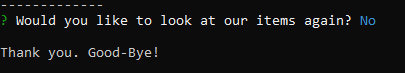
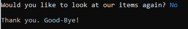

# Node-MySQL
This like an Amazon-like application. Users will get the option to pick what item to purchase and how many to purchase. The data will calculate what is left in stock.

## How it works:
1. Open terminal. (I am using Git Bash.)
2. Navigate to folder with file of bamazonCustomer.js. 
3. Always start with "node" and input bamazonCustomer.js.
4. Press Enter.

5. We see "connected as id" message. This confirms we are connected to MySQL. The first question displayed is to Buy or Exit. 

6. If User chooses Exit, the application ends. 
 

7. If User chooses Buy, the application will display items to purchase. There are a total of 10 items. (This image is only listing 6.) Information shown per item is the Item ID, Product, and Price.
 

8. As instructed, input ID number to purchase. Once done so, the application will then ask to input quantity.

 

The Name of Item chosen and Total is now displayed.
 

### Item Low in Stock

If an item is not enough to fulfill User request, a message will inform of this.  

It'll then ask if User would like to look at list of items again. 

If Yes, the list of items will show, thus, the application starts over. 

If No, the applications ends. 

### Continue shopping?

After displaying the Total, the application will ask if User would like to look at items again. 

By picking Yes, the application starts over 

By picking No, the application ends. 

## Technologies Used
This application uses npm packages of mysql and inqurier. It is build with Node.js and MySQL. 

